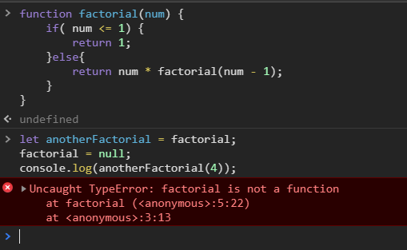

递归函数是在一个函数通过名字调用自身的情况下构成的，如下所示：

```js
function factorial(num) {
    if( num <= 1) {
        return 1;
    }else{
        return num * factorial(num - 1);
    }
}
```

这是一个经典的递归阶乘函数。虽然这个函数表面上看来没什么问题，但是下面的代码可能导致他出错。
<!-- more -->

```js
let anotherFactorial = factorial;
factorial = null;
console.log(anotherFactorial(4));
```

以上代码先把 factorial() 函数保存在变量 anotherFactorial 中，然后将 factorial 变量设置为 null ，结果指向原始函数的引用只剩下一个。但在接下来调用 anotherFactorial() 时，由于必须执行 factorial() ，而 factorial 已经不再是函数，所以就会导致错误。在这种情况下，使用 arguments.callee 可以解决这个问题。


我们知道， arguments.callee 是一个指向正在执行的函数的指针， 因此可以用它来实现对函数的递归调用，例如：

```js
function factorial(num) {
    if( num <= 1) {
        return 1;
    }else{
        return num * arguments.callee(num - 1);
    }
}
```

通过使用 arguments.callee 代替函数名，可以确保无论怎样调用函数都不会出问题。因此，在编写递归函数时，使用 arguments.callee 总比使用函数名更为保险。
但在严格模式下，不能通过脚本访问 arguments.callee ，访问这个属性会导致错误。 不过，可以使用命名函数表达式来达成相同的结果。例如：

```js
let factorial = (function f(num) {
    if( num <= 1) {
        return 1;
    }else{
        return num * f(num - 1);
    }
})
```

以上代码创建了一个名为 f() 的命名函数表达式，然后将它赋值给变量 factorial 。 即便把函数赋值给了另外一个变量，函数的名字 f 仍然有效，所以递归调用照样能正确完成，这种方式在严格模式和非严格模式下都行得通。
